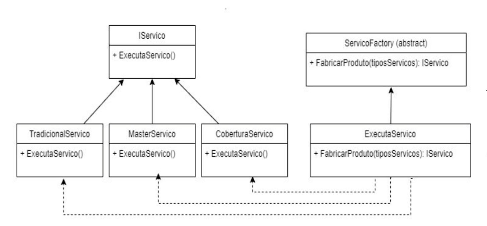

# Factory Method

O **Factory Method** é um Design Pattern do tipo **criacional**.

Ele serve para **organizar a criação de objetos**, principalmente quando o sistema possui várias classes diferentes que seguem o mesmo contrato/interface.

A ideia principal é:

> Quem usa o objeto não precisa saber exatamente qual classe concreta está sendo criada.

---

## Qual problema ele resolve?

Imagine que temos vários tipos de serviço:

- `TradicionalServico`
- `MasterServico`
- `CoberturaServico`
- `PremiumServico`

Todos esses serviços fazem a mesma coisa principal:

```csharp
ExecutaServico()
````

Porém, cada um executa de uma forma diferente.

Sem o Factory Method, o código cliente poderia ficar responsável por decidir qual classe criar:

```csharp
IServico servico;

if (tipo == ETipoServicos.Tradicional)
{
    servico = new TradicionalServico();
}
else if (tipo == ETipoServicos.Master)
{
    servico = new MasterServico();
}
else if (tipo == ETipoServicos.Cobertura)
{
    servico = new CoberturaServico();
}
else
{
    servico = new PremiumServico();
}

servico.ExecutaServico();
```

O problema desse código é que o cliente precisa conhecer todas as classes concretas.

Ou seja, quem só deveria **usar o serviço**, também acaba sendo responsável por **criar o serviço correto**.

Isso gera alguns problemas:

* o código cliente fica acoplado às classes concretas;
* a lógica de criação fica espalhada;
* cada novo serviço exige alteração no cliente;
* o código começa a ficar mais difícil de manter.

---

## A ideia do Factory Method

O Factory Method separa a responsabilidade de criação.

Em vez de o cliente criar diretamente um serviço com `new`, ele pede para uma fábrica criar.

Exemplo:

```csharp
var factory = new SelectionServico();

IServico servico = factory.FabricarProduto(ETipoServicos.Master);

servico.ExecutaServico();
```

Agora o cliente não precisa saber se existe `MasterServico`, `TradicionalServico`, `CoberturaServico` ou `PremiumServico`.

Ele só sabe que recebeu algo que implementa:

```csharp
IServico
```

E por isso pode executar:

```csharp
servico.ExecutaServico();
```

---

## Estrutura do padrão

O Factory Method geralmente possui duas partes principais:

---

## 1. Produto

O produto é aquilo que será criado pela fábrica.

No seu exemplo, o produto base é a interface:

```csharp
IServico
```

Ela define o comportamento que todos os serviços devem ter:

```csharp
public interface IServico
{
    void ExecutaServico();
}
```

As classes concretas implementam essa interface:

```csharp
public class TradicionalServico : IServico
{
    public void ExecutaServico()
    {
        Console.WriteLine("Executando serviço tradicional");
    }
}
```

```csharp
public class MasterServico : IServico
{
    public void ExecutaServico()
    {
        Console.WriteLine("Executando serviço master");
    }
}
```

```csharp
public class CoberturaServico : IServico
{
    public void ExecutaServico()
    {
        Console.WriteLine("Executando serviço cobertura");
    }
}
```

```csharp
public class PremiumServico : IServico
{
    public void ExecutaServico()
    {
        Console.WriteLine("Executando serviço premium");
    }
}
```

Essas classes são chamadas de **produtos concretos**.

---

## 2. Factory

A factory é a classe responsável por criar os produtos.

No seu projeto, você tem uma classe abstrata parecida com:

```csharp
public abstract class ServicoFactory
{
    public abstract IServico FabricarProduto(ETipoServicos tipoServico);
}
```

Ela define que toda factory precisa ter um método para fabricar um serviço.

Depois, uma classe concreta implementa essa criação:

```csharp
public class SelectionServico : ServicoFactory
{
    public override IServico FabricarProduto(ETipoServicos tipoServico)
    {
        return tipoServico switch
        {
            ETipoServicos.Tradicional => new TradicionalServico(),
            ETipoServicos.Master => new MasterServico(),
            ETipoServicos.Cobertura => new CoberturaServico(),
            ETipoServicos.Premium => new PremiumServico(),
            _ => throw new ArgumentException("Tipo de serviço inválido")
        };
    }
}
```

Essa classe é responsável por decidir qual serviço concreto será criado.

---

## Como utilizar

O uso fica simples.

O cliente cria ou recebe uma factory:

```csharp
ServicoFactory factory = new SelectionServico();
```

Depois pede para a factory criar o serviço desejado:

```csharp
IServico servico = factory.FabricarProduto(ETipoServicos.Master);
```

E então executa o serviço:

```csharp
servico.ExecutaServico();
```

Exemplo completo:

```csharp
ServicoFactory factory = new SelectionServico();

IServico servico = factory.FabricarProduto(ETipoServicos.Master);

servico.ExecutaServico();
```

O ponto importante é que o cliente trabalha com a interface:

```csharp
IServico
```

E não diretamente com:

```csharp
MasterServico
```

---

## Por que utilizar?

O Factory Method é utilizado para deixar o código mais organizado, flexível e menos acoplado.

A principal vantagem é que o cliente não precisa saber como o objeto é criado.

Ele apenas solicita um serviço e usa o comportamento definido pela interface.

---

## Exemplo sem Factory Method

Sem factory, o cliente faz isso:

```csharp
var servico = new MasterServico();

servico.ExecutaServico();
```

Aqui o cliente depende diretamente de `MasterServico`.

Se amanhã a criação de `MasterServico` mudar, o cliente pode ser afetado.

---

## Exemplo com Factory Method

Com factory, o cliente faz isso:

```csharp
IServico servico = factory.FabricarProduto(ETipoServicos.Master);

servico.ExecutaServico();
```

Agora o cliente não depende mais diretamente de `MasterServico`.

Ele depende apenas de `IServico`.

A responsabilidade de decidir qual classe criar fica na factory.

---

## Relacionando com a imagem

A imagem abaixo representa a estrutura do Factory Method aplicada ao seu exemplo.



Na imagem:

* `IServico` é a interface do produto;
* `TradicionalServico`, `MasterServico` e `CoberturaServico` são produtos concretos;
* `ServicoFactory` é a factory abstrata;
* `ExecutaServico` representa a factory concreta;
* o método `FabricarProduto(tipoServicos)` cria e retorna um `IServico`.

No seu código, você também criou o `PremiumServico`, que é mais uma implementação concreta de `IServico`.

---

## Fluxo do código

O fluxo do Factory Method no seu projeto é:

1. O cliente informa qual tipo de serviço deseja.
2. A factory recebe esse tipo.
3. A factory escolhe qual classe concreta deve ser criada.
4. A factory retorna um objeto do tipo `IServico`.
5. O cliente executa o serviço sem saber qual classe concreta foi instanciada internamente.

Exemplo:

```csharp
ServicoFactory factory = new SelectionServico();

IServico servico = factory.FabricarProduto(ETipoServicos.Premium);

servico.ExecutaServico();
```

Nesse exemplo, o cliente não precisa fazer:

```csharp
new PremiumServico()
```

Ele apenas pede para a factory fabricar o serviço correto.

---

## Quando faz sentido usar?

O Factory Method faz sentido quando:

* você tem várias classes que implementam a mesma interface;
* a escolha da classe depende de algum tipo, condição ou regra;
* você quer evitar vários `if`, `else` ou `switch` espalhados pelo sistema;
* você quer centralizar a criação dos objetos;
* você quer reduzir o acoplamento entre o cliente e as classes concretas.

No seu exemplo, faz sentido porque existem vários tipos de serviço, mas todos seguem o mesmo contrato:

```csharp
IServico
```

---

## Quando pode ser exagero?

Nem sempre é necessário usar Factory Method.

Se você tem apenas uma classe simples e não existe variação na criação do objeto, criar uma factory pode deixar o código mais complexo sem necessidade.

Por exemplo, se existisse apenas:

```csharp
TradicionalServico
```

E nunca fosse existir outro tipo de serviço, talvez a factory não fosse necessária.

O padrão começa a fazer mais sentido quando existem várias possibilidades de criação.

---

## Vantagens

* Centraliza a criação dos objetos.
* Reduz o acoplamento com classes concretas.
* Facilita a manutenção.
* Facilita a adição de novos tipos.
* Deixa o código cliente mais limpo.
* Trabalha bem com interfaces e polimorfismo.

---

## Desvantagens

* Cria mais classes no projeto.
* Pode parecer mais complexo no começo.
* Pode ser desnecessário em sistemas muito simples.

---

## Resumo simples

O Factory Method responde à pergunta:

> Quem deve criar o objeto correto?

A resposta é:

> Uma factory.

Então, em vez de o cliente fazer isso:

```csharp
new MasterServico()
```

Ele faz isso:

```csharp
factory.FabricarProduto(ETipoServicos.Master)
```

Assim, o cliente não precisa saber qual classe concreta será criada.

Ele apenas recebe um objeto que implementa `IServico` e usa normalmente.

---

## Resumo final

No seu projeto, o Factory Method serve para criar diferentes tipos de serviço sem que o cliente precise conhecer diretamente as classes concretas.

Você tem uma interface:

```csharp
IServico
```

E várias implementações:

```csharp
TradicionalServico
MasterServico
CoberturaServico
PremiumServico
```

A factory recebe um tipo de serviço e retorna a implementação correta.

Com isso, o código fica mais organizado, menos acoplado e mais fácil de evoluir.

A ideia principal é:

> Quem usa o objeto não precisa saber como ele é criado.

```
```
